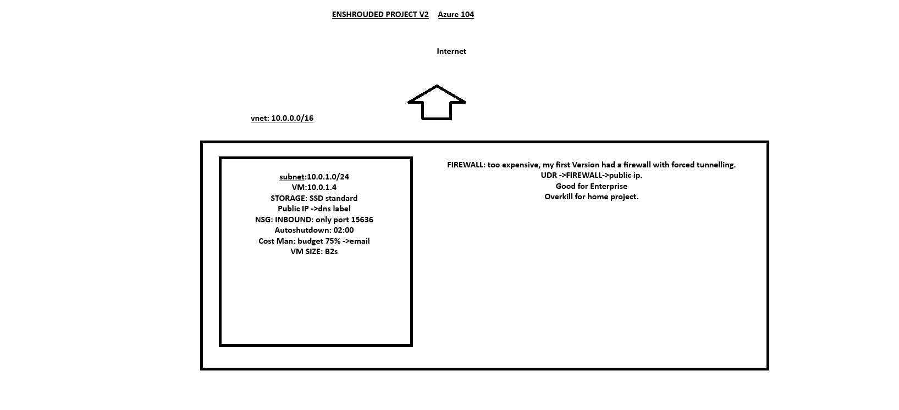
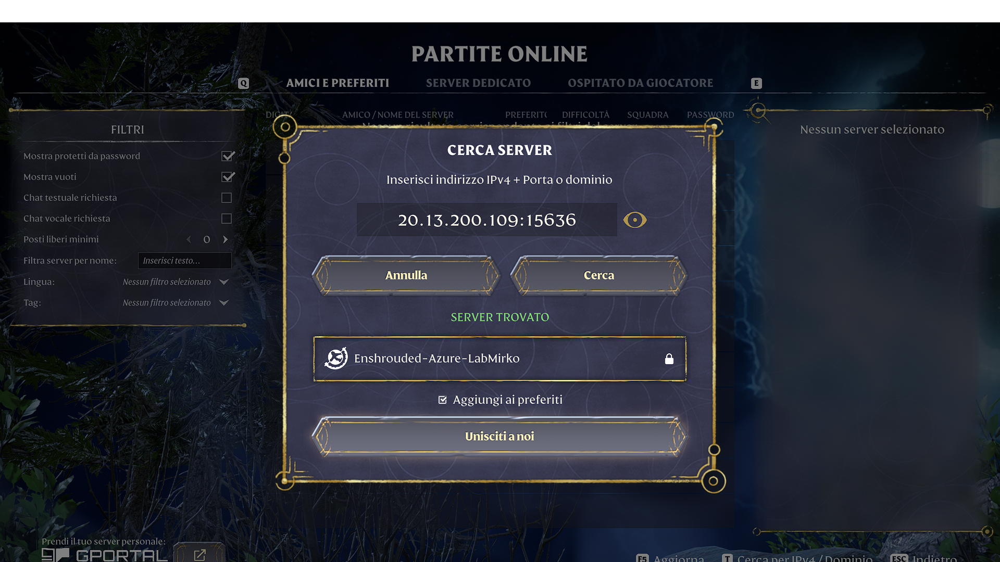
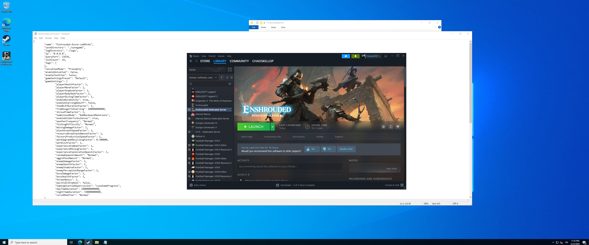

# azure-project-enshrouded-server
# Enshrouded Dedicated Server on Microsoft Azure

## Overview
Deployed a dedicated Enshrouded game server on Microsoft Azure using a cost-efficient and secure architecture.

## Architecture
- Virtual Network (VNet) with subnet segmentation
- Network Security Group (NSG) allowing only required inbound ports (3389 for RDP, 15636 for game traffic)
- Windows Virtual Machine hosting the game server
- Public IP with DNS label for external access
- Auto-shutdown configured to optimize costs

## Deployment Steps
1. Created VNet and subnet
2. Configured NSG with minimal required inbound rules
3. Deployed Virtual Machine (initially Linux, later switched to Windows for compatibility)
4. Installed and configured Enshrouded Dedicated Server
5. Verified external connectivity using public IP and port

## Challenges
- Linux deployment failed due to compatibility issues with the game server
- Attempted workaround using Wine, but switched to Windows VM for stability
- NSG configuration required troubleshooting to allow correct inbound traffic

## Result
Successfully deployed a fully functional dedicated server accessible from an external client via public IP.

## Screenshots
## Architecture

### Server Connection

### Windows VM (RDP)

## Skills Demonstrated
- Azure Virtual Machines
- Virtual Networking (VNet, Subnet, NSG)
- Troubleshooting and problem solving
- Basic system administration (Linux & Windows)
- Cloud cost management
